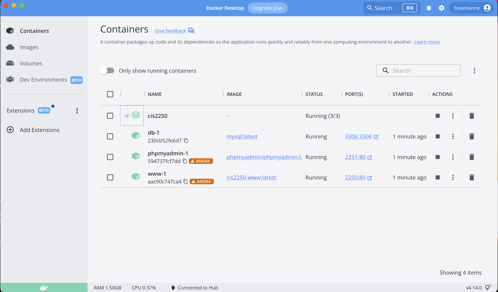

# Welcome to CIS 2250!
## Web Site Development with PHP

Hello class! This is the base repository you will need to clone to proceed in 
the course. It has everything you need to get started and is based off of the
popular XAMPP stack.

XAMP Stands for:
* X - cross platform (runs on Windows, Mac, and Linux)
* A - Apache (a web server)
* M - MySQL (a database)
* P - PHP (a server-side scripting language)
* P - Perl (a scripting language)

## Docker
This setup requires [Docker](https://www.docker.com) to run. 
As the installation instructions change frequently and vary depending on your
platform, please go to [the docker website](https://www.docker.com) 
and follow the instructions there to get docker up and running on your machine.

Test your installation by opening up a command prompt or terminal and running:

``` docker --version ```

This command should output something resembling a version number and not error
out. If you get errors while running this command, try installing docker again.

Once you have docker installed on your system and the version command returns,
start your XAMPP server by running:

``` docker-compose up ```

Then open your favorite web browser, navigate to
[http://localhost:2250](http://localhost:2250)
and you should see a 
*Welcome to CIS 2250* message and information about your
PHP installation.

PhpMyAdmin will be running on port 2251 at
[http://localhost:2251](http://localhost:2251)

I put MySQL on port 2252 since some other classes at Sinclair use the default
port of 3306 already. The thing to remember about MySQL in docker is that if
you *stop* the docker image, that's ok, everything will be there when you start
it back up again. But if you *delete* the image, then your data will be gone
and you'll be back to whatever you have in your sql folder being in the 
database.

If you have installed docker correctly and run the commands above, you should be
able to open Docker desktop and see something like the following:




## Project Layout
### sql
This directory contains sql used to create your database. 
You should put in here sql files for initializing your
database schema and any initial data your application needs.
We'll cover this later on in the second half of the course.

### www
This directory contains all of the php and other resources
your web application needs. 

## Using Docker
Your sql files in your sql folder will get executed when the mysql image is
built. To make changes you'll need to:
1. Stop the CIS2250 container and all images running under it.
2. Open up Docker Desktop and delete the mysql image
3. Re-run `docker-compose up` from the project root directory in a terminal
4. Your SQL will get executed again. Check the results in PhpMyAdmin.
